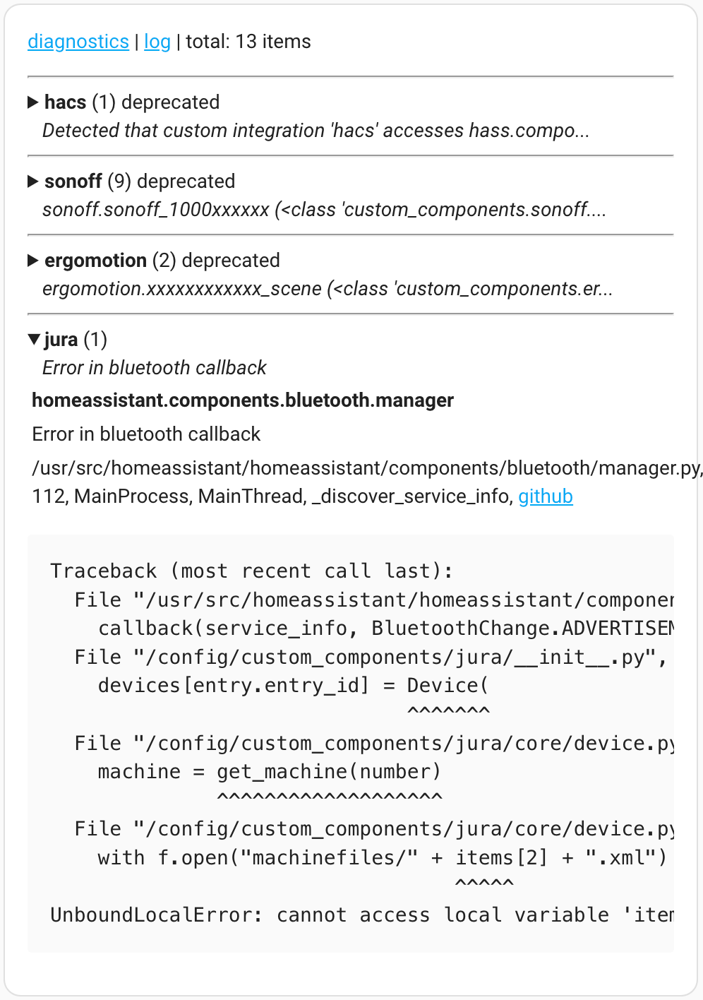

# Hass Diagnostics

Diagnostics entities for [Home Assistant](https://www.home-assistant.io/).

## Installation

[HACS](https://hacs.xyz/) custom repository: `AlexxIT/HassDiagnostics`.

[](https://my.home-assistant.io/redirect/hacs_repository/?owner=AlexxIT&repository=HassDiagnostics&category=Integration)

Or manually copy `hass_diagnostics` folder from [latest release](https://github.com/AlexxIT/HassDiagnostics/releases/latest) to `/config/custom_components` folder.

## Configuration

Add integration via Home Assistant UI.

[](https://my.home-assistant.io/redirect/config_flow_start/?domain=hass_diagnostics)

## Smart Log

Creates a sensor whose data can be displayed with a [Markdown card](https://www.home-assistant.io/dashboards/markdown/).

- combining issues by integration, category, and device IP address
- displaying short text of problem
- displaying where possible:
  - integration name
  - python library name
  - issue category
  - IP address of the device
  - link to github sources



**Markdown card - version 1**

```markdown
[diagnostics](/config/integrations/integration/hass_diagnostics) | [log](/config/logs) | total: {{ states('sensor.smart_log') }} items


---
<details>
<summary>
  <b>{{i.get('domain') or i.get('package') or i.name}}</b> ({{i.count}}) {{i.get('category','')}} {{i.get('host','')}}
  <br>&nbsp; &nbsp;<i>{{i.short}}</i>
</summary>
<table>
  <tr><td><b>{{i.name}}</b></td></tr>
  <tr><td>{{i.message|replace('\n',' ')|regex_replace('(http[^\s]+)', '<a href="\\1">\\1</a>')}}</td></tr>
  <tr><td>{{i.source|join(', ')}}{{', <a href="%s">github</a>'%i.github if 'github' in i}}</td></tr>
</table>
{{'<pre>'+i.exception+'</pre>' if 'exception' in i}}
</details>


```

**Markdown card - version 2**

```markdown
[diagnostics](/config/integrations/integration/hass_diagnostics) | [log](/config/logs) | total: {{ states('sensor.smart_log') }} items

- **{{i.get('domain') or i.get('package') or i.name}}** ({{i.count}}) {{i.get('category','')}} {{i.get('host','')}}
  *{{i.short}}*

```

## Start Time

Creates a sensor, with Home Assistant start time from the logs.

```
2020-02-24 17:13:11 INFO (MainThread) [homeassistant.bootstrap] Home Assistant initialized in 25.5s
```
